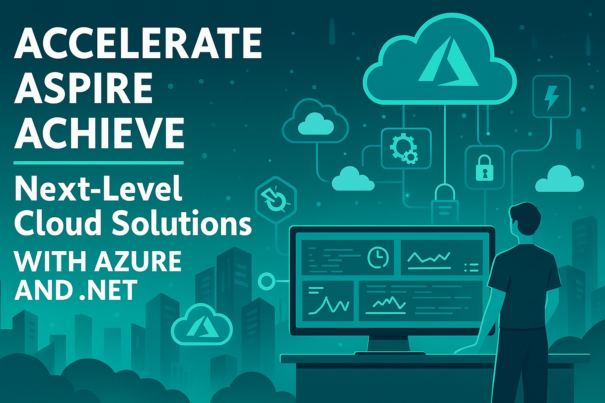
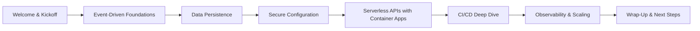

# Accelerate, Aspire, Achieve Next-Level Cloud Solutions with Azure and .NET

 🗣️ Workshop 🟢 Intermediate

**Abstract:**   Immerse yourself in a full-day interactive workshop that empowers you to harness the true potential of serverless computing on Azure using .NET. Designed for innovative developers and forward-thinking architects, this session blends in-depth theory with hands-on labs that walk you through architecting, developing, and deploying production-grade serverless applications. Discover how Azure's native services and the .NET framework work together to build scalable, resilient, and cost-efficient solutions. With this experience, you’ll accelerate your development and aspire to create groundbreaking cloud architectures that drive digital innovation.

**Repository:** GitHub Repository

## Overview

This workshop is a deep dive into **end-to-end serverless development on Azure with .NET**. It combines architectural insights, real-world trade-offs, and hands-on labs that simulate production scenarios. Attendees will leave with practical skills in designing, deploying, and governing cloud-native applications that scale seamlessly and optimize costs.

The content has evolved to reflect the latest in **Azure Functions, Container Apps, CI/CD pipelines, observability, and governance practices**—ensuring relevance for both developers and architects navigating today’s cloud landscape.

#### Elevator Pitch

Serverless is more than just Functions—it’s a mindset for building resilient, scalable, and cost-efficient systems. In this workshop, you’ll learn how to combine Azure’s serverless services with .NET to deliver production-ready solutions, backed by hands-on labs that reinforce every concept.

#### Tags

          

## Agenda / Outline

- **09:00 – 09:30 | Welcome & Kickoff:**  
  Introductions, workshop goals, architecture diagram walkthrough, Lab 0 (Terraform + CI/CD scaffolding)
- **09:30 – 10:45 | Step 1 – Event-Driven Foundations**  
  Functions + Service Bus, Lab 1 (Function triggered by Service Bus, CI/CD integration)
- **10:45 – 11:45 | Step 2 – Data Persistence**  
  Choosing persistence (Table Storage vs. Cosmos DB), Lab 2 (audit logs + order data, CI/CD updates)
- **11:45 – 12:00 | Morning Recap & Q&A**
- **12:00 – 13:00 | Lunch Break 🍴**
- **13:00 – 14:15 | Step 3 – Secure Configuration  
  Key Vault + App Config, Lab 3 (secrets/config integration, CI/CD updates)
- **14:15 – 15:30 | Step 4 – Serverless APIs with Container Apps**  
  When to use Container Apps vs. Functions, Lab 4 (order submission/query API, CI/CD updates)
- **15:30 – 15:45 | Afternoon Break ☕**
- **15:45 – 16:45 | Step 5 – CI/CD Deep Dive**  
  Pipelines with GitHub Actions + Azure DevOps, Lab 5 (multi-service deployment, smoke tests)
- **16:45 – 17:30 | Step 6 – Observability & Scaling**  
  Monitoring, logging, scaling strategies, Lab 6 (App Insights, load tests, cost optimization)
- **17:30 – 18:00 | Wrap-Up & Next Steps**  
  Review completed architecture, key takeaways, resources, and open Q&A

## Key Takeaways

- **End-to-End Serverless Mastery:** Architect, build, and deploy production-grade serverless solutions with Azure + .NET.
- **Hands-On Experience:** Gain confidence through labs that simulate real-world production scenarios.
- **Scalability & Governance:** Learn patterns for cost optimization, observability, and resilient architectures.

## Materials & Resources

- **Source Code / Repository:** GitHub Repository
- **Additional Links:**
  - Azure Functions Documentation
  - Azure Container Apps
  - Terraform on Azure

## Event History

| Event                                                        | Location    | Date       | Length   | Submission   | Materials   | Recording |
| ------------------------------------------------------------ | ----------- | ---------- | -------- | ------------ | ----------- | --------- |
| [Live! 360](https://live360events.com/events/orlando-2025/sessions/sunday/cchol01-cloud-solutions.aspx) | Orlando, FL | 2025-11-16 | Full Day | ✅ 2025-03-22 | View Slides | N/A       |

✅ Accepted | ⏳ Pending | ❌ Rejected

## Audience & Engagement

- **Audience:** Intermediate-level developers and architects with .NET and Azure experience.
- **Prerequisites:** Familiarity with C#, basic Azure concepts, and Git workflows.
- **Engagement:** Hands-on labs, live demos, interactive Q&A, and real-world case studies.
- **Feedback & Connection:** Attendees can connect via GitHub, LinkedIn, or conference feedback forms.

## Conference-Specific Customizations

### Accelerate, Aspire, Achieve Next-Level Cloud Solutions with Azure and .NET

**Title:** Accelerate, Aspire, Achieve Next-Level Cloud Solutions with Azure and .NET  

**Abstract:**

Immerse yourself in a full-day interactive workshop that empowers you to harness the true potential of serverless computing on Azure using .NET. Designed for innovative developers and forward-thinking architects, this session blends in-depth theory with hands-on labs that walk you through architecting, developing, and deploying production-grade serverless applications. Discover how Azure's native services and the .NET framework work to build scalable, resilient, and cost-efficient solutions. With this experience, you'll accelerate your development and aspire to create groundbreaking cloud architectures that drive digital innovation.

You will learn:

- Master End-to-End Serverless Development: Gain a deep understanding of serverless principles and learn how to architect robust solutions on Azure using .NET—from initial concept to full-scale deployment.
- Acquire Real-World, Hands-On Expertise: Engage in immersive labs that simulate production scenarios, empowering you to implement, troubleshoot, and refine serverless applications in real-time.
- Optimize for Scalability and Cost-Efficiency: Learn best practices for building resilient, high-performance architectures that scale seamlessly, maximize cost savings, and set the stage for your next significant innovation.

**Tags:** No Tags

## Final Thoughts

This workshop represents the culmination of real-world lessons in **serverless architecture, IaC, and CI/CD**. As Azure and .NET evolve, the content will continue to adapt—integrating new services, patterns, and best practices to keep attendees at the forefront of cloud innovation.