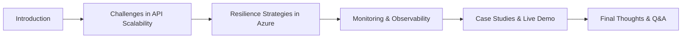

# Building Resilient and Scalable APIs in Azure

 🗣️Talk 🔵 Intermediate

**Abstract:**  

Modern applications demand APIs that can withstand failures and dynamically scale to meet demand. In this session, we’ll explore how **Azure API Management, Azure Functions, and Azure Container Apps** can help design resilient and scalable APIs that remain operational under pressure.

- **High Availability & Disaster Recovery:** Architecting APIs to ensure seamless failover and minimal downtime.
- **Resilience Strategies:** To enhance reliability, implement **retry policies, circuit breakers, and throttling**.
- **Monitoring & Observability:** Using **Azure Monitor** and **Application Insights** for real-time performance tracking.
- **Live Demo & Real-World Scenarios:** Watch Azure tools in action as we integrate resilience techniques into a scalable API framework.

Whether you’re a **developer, architect, or IT professional**, this session provides actionable strategies for **future-proofing your APIs and optimizing their reliability in cloud-native environments**.

**Repository:**  [GitHub Repository](https://github.com/yourusername/your-presentation-repo)

---

## Overview

APIs are the backbone of modern applications, and it is critical to ensure they remain **available, performant, and scalable**. This talk covers architectural strategies for designing APIs that can **recover from failures**, maintain **optimal performance**, and adapt to varying workloads using **Azure services**.

#### Elevator Pitch

Resilient APIs fuel scalable applications. Learn how Azure API Management, Functions, and Azure Container Apps work together to create reliable, high-performing API architectures.

#### Tags

   

---

## Agenda / Outline

- **Introduction:**   Why resilient APIs matter in modern cloud environments.
- **Challenges in API Scalability:**   Addressing availability, performance, and disaster recovery concerns.
- **Resilience Strategies in Azure:**   Leveraging **API gateways, retry policies, circuit breakers, and auto-scaling**.
- **Monitoring & Observability:**   Using **Azure Monitor & Application Insights** to track API performance.
- **Case Studies & Live Demo:**   Real-world success stories and practical demonstrations of resilience techniques.
- **Final Thoughts & Q&A:**   Key takeaways and audience engagement.

---

## Key Takeaways

- **Resilient API Design:** Ensuring high availability & fault tolerance.

  **Scalability Techniques:** Using Azure services to scale APIs dynamically.

  **Observability Best Practices:** Monitoring APIs effectively for performance & security.

---

## Materials & Resources

- **Source Code / Repository:** [Link to GitHub Repository](https://github.com/yourusername/your-presentation-repo)
- **Additional Links:** Supplementary blog posts, tools, or external resources mentioned during your talk.

---

## Event History

This table tracks every conference or event where this presentation has been submitted and the outcome.

| Event                | Location     | Date       | Length | Submission   | Materials | Recording |
| -------------------- | ------------ | ---------- | ------ | ------------ | --------- | --------- |
| APICon New York 2025 | New York, NY | 2025-09-28 | 45     | ⏳ 2025-04-18 | N/A       | N/A       |

✅ Accepted | ⏳ Pending | ❌ Rejected

---

## Audience & Engagement

This talk is designed for developers, architects, and IT professionals who work with cloud-based APIs. It will include practical discussions, live demonstrations, and interactive engagement on API resilience strategies.

## Conference-Specific Customizations

Some conferences require adjustments to the presentation details to better align with their themes or audience. Below are the variations applied for specific event submissions.

### APICon New York 2025

**Title:** Scaling APIs Like a City That Never Sleeps: Building Resilient APIs in Azure  
**Abstract:**  
Like New York City thrives on its interconnected infrastructure, high availability, and adaptability, modern APIs must scale effortlessly and remain resilient under pressure. This session will explore how Azure API Management, Azure Functions, and Azure Container Apps provide the foundation for high-performing, fault-tolerant APIs, like the systems that power the city itself.

- **Surviving Peak Traffic:** Strategies for auto-scaling APIs during high-demand periods, like rush hour in Manhattan.
- **Resilient Architecture:** Implementing retry policies, circuit breakers, and throttling to withstand unexpected failures, like how NYC keeps running through disruptions.
- **Observability & Monitoring:** Azure Monitor and Application Insights are used to gain insights and keep APIs functioning smoothly, just as the city relies on real-time data to manage operations.
- **Live Demo & Real-World Scenarios:** This demo showcases Azure-powered API resilience in action, mirroring how critical infrastructure in New York is built for scalability and reliability.

Whether you’re an architect, developer, or IT leader, this session will equip you with strategies for keeping your APIs running like a city's heartbeat—fast, scalable, and resilient.

**Tags:** JavaScript, AI, Innovation  

### Prairie Dev Con Winnipeg 2025

**Title:** From Outage to Triumph: Our Journey Building Resilient APIs in Azure

**Abstract:**  
Modern APIs need more than technical prowess—they must endure tough, real-world challenges. In this session, I’ll share how our team turned a crisis into an innovation opportunity. When an unexpected outage put our service to the test, we were forced to rethink our approach using Azure API Management, Azure Functions, and Azure Container Apps. We leaned into comprehensive high availability and disaster recovery strategies to ensure seamless failover and minimal downtime.

I’ll walk you through how we implemented resilience techniques like retry policies, circuit breakers, and throttling methods that didn’t just temporarily patch issues but transformed our system. Along the way, you’ll see how live monitoring with Azure Monitor and Application Insights kept us in the loop during critical moments and helped us learn valuable lessons for future improvements.

**Elevator Pitch:**  
Surviving an outage isn’t enough—thriving after one is the real challenge. I’ll reveal how we transformed a crisis into a resilient, scalable API framework using Azure. Learn hard-won lessons, see real-world solutions in action, and leave equipped to future-proof your cloud-native applications.

### APICon Berlin 2025

**Title:** Scaling APIs Like the Heart of Berlin: Building Resilient APIs in Azure  
**Abstract:**  
Berlin is a city defined by reinvention and grit. This session will explore how modern APIs can mirror that spirit by remaining robust and scaling dynamically under pressure. Using Azure API Management, Azure Functions, and Azure Container Apps, you’ll discover strategies that allow your APIs to overcome failures and thrive during surges gracefully.

- Urban Resilience: Architect for high availability and seamless failover, reflecting Berlin’s adaptive infrastructure.

- Ingenious Fail-Safes: Implement retry policies, circuit breakers, and throttling, turning challenges into opportunities, much like the city’s remarkable transformations.

- Real-Time Observability: Utilize Azure Monitor and Application Insights for live performance tracking, echoing Berlin’s data-driven approach to innovation.

- Live Demo: See these resilience techniques in action, drawing parallels to the dynamic pulse of Berlin’s tech scene.

Designed for developers, architects, and IT professionals alike, this session equips you with actionable insights to build cloud architectures that remain as resilient and transformative as Berlin.

---

## Final Thoughts

This session bridges the API **reliability and scalability** gap, providing practical solutions that developers and architects can **apply immediately**. As Azure continues to evolve, these strategies will remain essential for **future-proofing API infrastructures**.