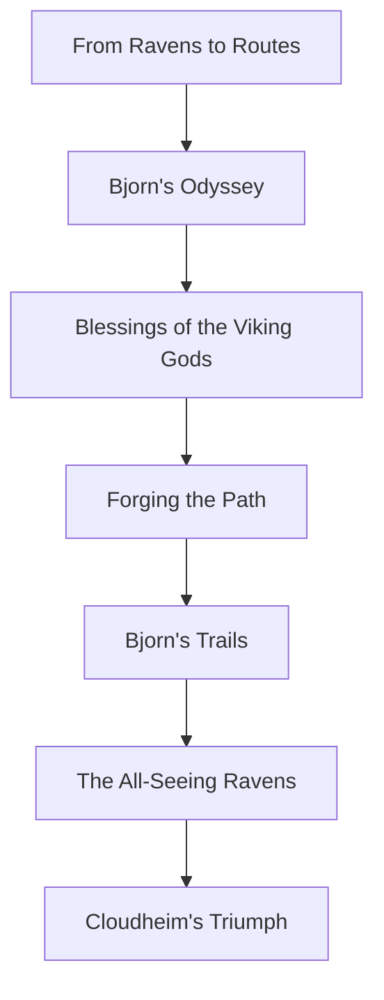

# Code, Connect, Conquer: Mastering Serverless and API-Centric Designs

 🗣️Talk 🟢 Introductory

**Abstract:**  
Embark on a journey through the Viking village of Cloudheim, where agility, scalability, and efficiency reign supreme. In this immersive session, Eirik the Enlightened and Bjorn the Bold will guide you through the foundational principles of serverless computing and API architecture, empowering you to embrace cloud-native development.

- **Discover Agility:** Understand how serverless computing minimizes operational overhead and accelerates development.
- **Build with Strength:** Learn how API design enhances modularity, reusability, and interoperability in modern architectures.
- **Overcome Challenges:** Navigate common obstacles such as cold-start latency, vendor lock-in, and security considerations.
- **Chart the Future:** Gain insights into emerging trends that will shape the evolution of serverless and API design.

With real-world examples, engaging storytelling, and interactive discussion, this session equips attendees with a strong foundation in serverless computing and API strategies. It is ideal for developers, architects, and technical leaders looking to integrate these technologies into their cloud journey.

**Repository:**  [GitHub Repository](https://github.com/TaleLearnCode/CodeConnectConquer)

---

## Overview

Serverless computing and API-driven development are transforming the software landscape. This talk introduces attendees to these technologies' core principles, advantages, and practical applications in modern cloud environments. By balancing technical insights with a creative thematic approach, attendees will leave with a clear understanding of how to leverage serverless architectures efficiently.

#### Elevator Pitch

Unlock the power of serverless computing and API architecture with an engaging journey through Cloudheim! Explore strategies to enhance agility, security, and scalability while tackling key challenges.

#### Tags

      

---

## Agenda / Outline

- **From Ravens to Routes:**  
  To be updated
  
- **Bjorn's Odyssey:**  
  To be updated
  
- **Blessings of the Viking Gods:**  
  To be updated
  
- **Forging the Path:**  
  To be updated
  
- **Bjorn's Trails:**  
  To be updated
  
- **The All-Seeing Ravens:**

  To be updated

- **Cloudheim's Triumph:**

  To be updated

---

## Key Takeaways

- **Serverless Fundamentals:** A clear understanding of why serverless computing matters.

  **API Architecture Insights:** How to design scalable and reusable APIs in a serverless ecosystem.

  **Common Pitfalls & Solutions:** Practical strategies for overcoming challenges like cold starts and security.

---

## Materials & Resources

- **Source Code / Repository:** [GitHub Repository](https://github.com/TaleLearnCode/CodeConnectConquer)
- **Additional Links:** Supplementary blog posts, tools, or external resources mentioned during your talk.

---

## Event History

This table tracks every conference or event where this presentation has been submitted and the outcome.

| Event                                                        | Location        | Date       | Length | Submission   | Materials                                                    | Recording |
| ------------------------------------------------------------ | --------------- | ---------- | ------ | ------------ | ------------------------------------------------------------ | --------- |
| KCDC 2025                                                    | Kansas City, MO |            | 60     | ⏳2025-02-19  | N/A                                                          | N/A       |
| Stir Trek 2025                                               | Columbus, OH    | 2025-05-02 | 60     | ❌ 2025-01-27 | N/A                                                          | N/A       |
| SDD 2025                                                     | London, UK      |            | 60     | ❌ 2024-08-31 | N/A                                                          | N/A       |
| CodeMash 2025                                                | Sandusky, OH    |            | 60     | ❌ 2024-08-31 | N/A                                                          | N/A       |
| Update Conference Prague 2024                                | Prague, CR      |            | 60     | ❌ 2024-05-27 | N/A                                                          | N/A       |
| [API Conference Berlin 2024](https://apiconference.net/berlin/) | Berlin, Germany | 2024-10-23 | 45     | ✅ YYYY-MM-DD | [Slides](https://github.com/TaleLearnCode/CodeConnectConquer/blob/main/EventMaterials/CodeConnectConquer-APIConBerlin2024.pdf) | N/A       |
| Momentum 2024                                                | Cincinnati, OH  |            | 45     | ❌ 2024-05-17 | N/A                                                          | N/A       |
| [Prairie Dev Con Winnipeg 2024](https://www.prairiedevcon.com/winnipeg.html) | Winnipeg, MB    | 2024-09-23 | 60     | ✅ YYYY-MM-DD | [Slides](https://github.com/TaleLearnCode/CodeConnectConquer/blob/main/EventMaterials/CodeConnectConquer-PDCWinnipeg2024.pdf) | N/A       |
| NDC Porto 2024                                               |                 |            | 60     | ❌ 2024-05-13 | N/A                                                          | N/A       |
| NDC TechTown 2024                                            |                 |            | 60     | ❌ 2024-04-14 | N/A                                                          | N/A       |

✅ Accepted | ⏳ Pending | ❌ Declined

---

## Audience & Engagement

This session is ideal for developers, architects, and cloud engineers exploring the intersection of serverless computing and API design. It balances technical insights with an engaging narrative, incorporating interactive discussion and audience participation.

## Conference-Specific Customizations

Some conferences require adjustments to the presentation details to better align with their themes or audience. Below are the variations applied for specific event submissions.

**No customizations**

---

## Final Thoughts

As serverless technology evolves, this talk remains adaptable to new trends and innovations. Introducing attendees to fundamental concepts while addressing real-world challenges serves as a starting point for deeper exploration into scalable API-centric architectures.