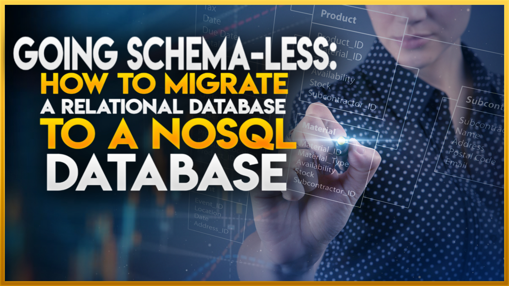
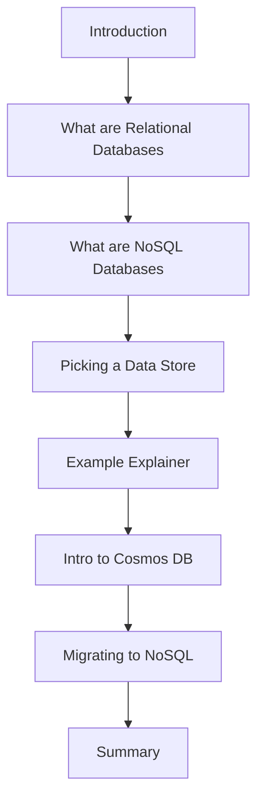

# Going Schema-less: How to Migrate a Relational Database to a NoSQL Database

 🗣️Talk 🟢 Introductory

**Abstract:**  The shift from relational databases to NoSQL opens doors to greater flexibility, scalability, and performance—but it’s not without challenges. Migrating successfully requires a deep understanding of schema-less design, data modeling, and strategic architecture decisions.

This session will guide you through the migration process, covering key advantages of NoSQL databases and the obstacles developers commonly face. Through real-world examples and case studies, we’ll explore optimizing data allocation strategies, avoiding common pitfalls, and adopting a polyglot persistence approach to leverage multiple database technologies effectively. Whether evaluating NoSQL for the first time or fine-tuning an existing migration strategy, you’ll walk away with practical insights to help you transition confidently.

**Repository:**  [GitHub Repository](https://github.com/TaleLearnCode/GoingSchemaless)

---

## Overview

Relational databases have long been the standard for structured data management, but the rise of NoSQL databases offers new opportunities for scalability, flexibility, and performance. While schema-less databases eliminate many constraints, migrating an existing relational system introduces unique challenges that developers must address. This session breaks down the key considerations for transitioning from SQL-based systems to NoSQL, offering real-world guidance on data transformation, query restructuring, and ensuring application compatibility.

Attendees will understand how to structure migration efforts, leverage NoSQL advantages without compromising data integrity, and make informed decisions about when to use a polyglot persistence model that integrates relational and NoSQL databases.

#### Elevator Pitch

Migrating to NoSQL? Learn how to transition from relational databases smoothly, optimize data strategies, and harness the power of schema-less scalability.

#### Tags

            

---

## Agenda / Outline

- **Introduction:**   Overview of database evolution and why organizations migrate from relational to NoSQL.
- **What are Relational Databases?**   Traditional database models, their strengths, and their limitations for modern applications.
- **What are NoSQL Databases?**   Key characteristics: flexibility, scalability, distributed architecture, and different NoSQL database types.
- **Picking a Data Store:**   Choosing the right NoSQL solution based on application needs and workload patterns.
- **Example Explainer:**   Hands-on migration example demonstrating schema transformation and query restructuring.
- **Very Quick Intro to Cosmos DB:**   Introduction to Cosmos DB as a distributed NoSQL database and its capabilities for seamless migration.
- **Migrating to NoSQL:**   Practical migration techniques, ETL processes, query optimization, and overcoming common roadblocks.
- **Summary:**   Key takeaways and best practices for a successful migration.

---

## Key Takeaways

-  **Understand the Advantages of NoSQL Databases:** Learn how schema-less structures and horizontal scaling improve agility and performance for diverse data models.
-  **Master the Migration Process:** Get a step-by-step breakdown of assessing, planning, and executing a smooth transition from relational to NoSQL databases.
-  **Leverage Polyglot Persistence for Optimization:** Explore strategies for integrating NoSQL with relational databases, optimizing data storage and retrieval based on use case requirements.

---

## Materials & Resources

- **Source Code / Repository:** [Link to GitHub Repository](https://github.com/TaleLearnCode/GoingSchemaless)
- **Additional Links:** Supplementary blog posts, tools, or external resources mentioned during your talk.

---

## Event History

This table tracks every conference or event where this presentation has been submitted and the outcome.

| Event   | Location      | Date       | Length | Submission   | Materials | Recording |
| ------- | ------------- | ---------- | ------ | ------------ | --------- | --------- |
| Event 2 | City, Country | YYYY-MM-DD | xxx    | ⏳ YYYY-MM-DD | N/A       | N/A       |

✅ Accepted | ⏳ Pending | ❌ Rejected

---

## Audience & Engagement

This talk is designed for software developers, data architects, and cloud engineers evaluating NoSQL databases or actively working on database migrations. A basic understanding of SQL and database principles is helpful but not required. The session will engage participants through live demonstrations, Q&A interactions, and real-world migration scenarios. Attendees can provide feedback via LinkedIn, Twitter, or GitHub.

## Conference-Specific Customizations

Some conferences require adjustments to the presentation details to better align with their themes or audience. Below are the variations applied for specific event submissions.

### Techoroma Netherlands 2025

**Title:** 🚴 Pedaling Towards NoSQL: Shifting Gears for Scalable Data Architecture 
**Abstract:**  
Migrating from a relational database to NoSQL is like switching from a classic Dutch city bike to a high-performance racing cycle—it requires adapting to a new pace, handling data differently, and optimizing for efficiency. While traditional SQL databases offer structured, predictable pathways, NoSQL brings **agility**, **flexibility**, and **scalability**, akin to navigating open roads rather than rigid cycle lanes.

This session explores how to **shift gears** smoothly during migration, ensuring data flows seamlessly without losing control. We’ll cover key NoSQL benefits like horizontal scaling and schema flexibility, while also tackling the roadblocks developers encounter during migration. Using real-world case studies, we’ll provide the **route map** to help attendees steer clear of common pitfalls and **ride** their data architecture toward speed and adaptability. Whether coasting through database transitions or sprinting toward cloud-native applications, this talk will prepare you to cycle ahead confidently!

---

## Final Thoughts

Migrating from relational databases to NoSQL requires careful planning, deep technical knowledge, and an understanding of effectively navigating trade-offs. This session equips attendees with a structured approach for evaluating, executing, and optimizing database migrations. Future updates will incorporate emerging database trends, new migration tools, and real-world case studies to enhance the session’s value.