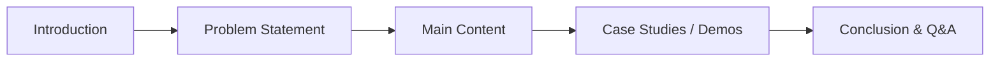

# Messaging Patterns that Transform Your Cloud Architecture

 🗣️Talk 🟢 Introductory

**Abstract:**  
In today’s fast-evolving cloud landscape, messaging patterns are the quiet enablers behind resilient, high-performance systems. This session unlocks the secrets of these paradigms—from Point-to-Point to the innovative Saga Pattern—to empower architects and developers to design systems that scale gracefully and respond dynamically. Through hands-on implementations and vivid real-world case studies, you’ll gain technical mastery and a fresh perspective on integrating effective, future-proof messaging in your cloud solutions.

**Repository:**  [GitHub Repository](https://github.com/TaleLearnCode/MessagingPatternsToTransformYourCloudArchitecture)

---

## Overview

Modern cloud architectures require efficient, reliable communication between services. Over time, messaging has evolved from a simple means of inter-service communication to a strategic pillar in achieving scalability, resilience, and maintainability. This session explores proven messaging techniques that power today’s distributed systems, combining theoretical insights with practical demonstrations. Whether refining an existing cloud solution or building a new one, you will gain fresh perspectives on leveraging messaging to drive innovation and performance.

#### Elevator Pitch

Unlock the power of messaging patterns to elevate your cloud architecture—master scalable, resilient communication strategies with live demos and actionable insights.

#### Tags

   

---

## Agenda / Outline

1. **Introduction (5 minutes)**
   - Welcome & Session Overview
   - The critical role of messaging patterns in transforming cloud scalability, resilience, and flexibility
   - Highlighting real-world success factors and industry impact
2. **Fundamentals of Messaging (10 minutes)**
   - Defining messaging within modern distributed systems
   - Essential considerations: latency, reliability, message routing
   - Strategic selection: Matching the correct pattern to the right challenge
3. **Core Messaging Patterns (30 minutes)**
   - *Point-to-Point:** Direct, exclusive message delivery
   - **Publish-Subscribe:** Efficient, wide-spectrum message broadcasting
   - **Message Queues:** Decoupling systems for enhanced scalability
   - **Request-Reply:** Synchronous communication for immediate feedback
   - **Event Sourcing:** Capturing immutable system state changes
   - **Saga Pattern:** Orchestrating and managing distributed transactions
4. **Implementation Walkthrough (10 minutes)**
   - Live, step-by-step demonstration of pattern deployment in real applications.
   - Addressing common pitfalls and detailing practical best practices
5. **Real-World Applications & Case Studies (5 minutes)**
   - Lessons learned from industry leaders
   - Concrete examples of transformative outcomes achieved through robust messaging
6. **Q&A + Closing Remarks (5 minutes)**
   - Interactive session addressing your specific challenges
   - Recap of key insights and actionable next steps to elevate your cloud strategy

---

## Key Takeaways

- Understand the essential messaging paradigms that form the foundation of resilient and scalable cloud systems.
- Learn step-by-step how to implement these messaging patterns in real-world applications.
- Discover actionable best practices to enhance system reliability, scalability, and performance.

---

## Materials & Resources

- **Source Code / Repository:** [Link to GitHub Repository](https://github.com/TaleLearnCode/MessagingPatternsToTransformYourCloudArchitecture)
- **Additional Links:** Supplementary blog posts, tools, or external resources mentioned during your talk.

---

## Event History

This table tracks every conference or event where this presentation has been submitted and the outcome.

| Event                                          | Location     | Date       | Length | Submission   | Materials                                 | Recording                                |
| ---------------------------------------------- | ------------ | ---------- | ------ | ------------ | ----------------------------------------- | ---------------------------------------- |
| Prairie Dev Con Winnipeg 2025                  | Winnipeg, MB | 2025-09-22 | 60     | ⏳ 2025-05-08 | [View Slides](https://link-to-slides.com) | [Watch Video](https://link-to-video.com) |
| Serverless Architecture Conference Berlin 2025 | Berlin, DE   |            | 45     | ⏳2025-05-16  |                                           |                                          |

✅ Accepted | ⏳ Pending | ❌ Rejected

---

## Audience & Engagement

This session is designed for cloud architects, developers, and technical leads involved in building distributed systems and microservices. A basic understanding of core cloud concepts is helpful. The talk actively engages the audience through live coding demos, interactive code walkthroughs, and a dedicated Q&A segment. Attendees are encouraged to share feedback and continue the conversation via Twitter, LinkedIn, or direct email.

## Conference-Specific Customizations

Some conferences require adjustments to the presentation details to better align with their themes or audience. Below are the variations applied for specific event submissions.

### Techoroma Netherlands 2025  

**Title:** Messaging Playbook: Winning Patterns for a Championship Cloud Architecture  
**Abstract:**  
Building a cloud architecture that scales, responds, and thrives under pressure is like coaching a winning sports team. Success depends on selecting the right strategies—messaging patterns that allow services to collaborate seamlessly, react in real-time, and handle unpredictable events with resilience. In this session, we'll explore key messaging paradigms—Point-to-Point, Publish-Subscribe, Message Queues, Request-Reply, Event Sourcing, and Saga Patterns—through the lens of sports strategy. You'll see these patterns in action, like how championship teams use coordination, agility, and persistence to outperform their competition. Whether designing a microservices-based architecture or fine-tuning your cloud application, you’ll gain playbook-worthy techniques to make your system as adaptable and effective as a well-trained athlete.

### Prairie Dev Con 2025

**Title:** Silos to Symphony: Our Journey with Messaging Patterns in the Cloud

**Abstract**:  
Our cloud architecture once struggled with disjointed communication and brittle integrations. When our systems began to falter, we turned to messaging patterns as our salvation. Through trial and error, we discovered that embracing paradigms—from classic Point-to-Point to the innovative Saga pattern—could transform our scattered components into a harmonized, resilient system.

In this session, I’ll share the rollercoaster story behind our transformation. I’ll recount early missteps and breakthrough moments that drove us to reimagine data flows and communication channels. Expect to dive into hands-on case studies where simple messaging turned a failing system into one that scales gracefully, adapts dynamically, and withstands disruptions. This isn’t just a technical exploration; it’s a narrative of how real-world challenges spurred us to adopt messaging patterns that unlocked unprecedented performance and reliability in our cloud solutions.

**Elevator Pitch:**

Transform your cloud chaos into harmony! Discover how we re-engineered our architecture using messaging patterns—from Point-to-Point to Saga—unlocking scalability, resilience, and dynamic response. Join our journey to witness real-world transformation in action.

### Serverless Architecture Conference Berlin 2025

**Title:** The Architecture of Connection: Messaging Patterns for Cloud Scalability  
**Abstract:**  
Berlin is a city built on connections, historically, technologically, and culturally. Just as Berlin evolved from fragmented divisions into a unified tech powerhouse, modern cloud architectures rely on messaging patterns to synchronize, scale, and respond dynamically to ever-changing demands.

In this session, discover how messaging patterns form the backbone of resilient cloud systems, enabling seamless communication across distributed architectures. Key topics include:

- Point-to-Point & Pub/Sub Messaging: Structuring reliable communication, much like Berlin’s efficient transportation networks.
- Event-Driven Design: Reacting dynamically to real-time triggers—akin to Berlin’s vibrant startup ecosystem.
- Saga Pattern & Distributed Transactions: Ensuring consistency across complex workflows, mirroring Berlin’s adaptive infrastructure.
- Resilient Cloud Integration: Building fault-tolerant message flows, inspired by Berlin’s reinvention through history.
- Real-World Case Studies & Live Demos: Showcasing practical implementations that future-proof cloud messaging strategies.

Through hands-on demonstrations and vivid case studies, attendees will gain technical mastery over messaging paradigms that enhance scalability, reliability, and efficiency, just like Berlin’s transformation into one of Europe’s most connected cities.

---

## Final Thoughts

This presentation has evolved through rigorous real-world testing and continuous refinement to reflect the latest cloud architecture and messaging trends. By pairing theory with extensive hands-on demonstrations, "Messaging Patterns that Transform Your Cloud Architecture" provides a clear roadmap for building future-ready systems. Future updates will incorporate emerging technologies and additional case studies to ensure the talk remains fresh, relevant, and actionable.