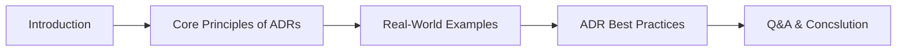

# Navigating the Maze of Architecture Decisions

 🗣️Talk 🟢 Introductory

**Abstract:**  
Clarity in articulating design choices is the bedrock of successful software architecture. This session explores the transformative power of Architecture Decision Records (ADRs) as a tool to capture the nuanced "why" behind every architectural choice, from selecting a framework to defining a core pattern. Through compelling real-world examples, we deconstruct the essentials of ADRs, demonstrating how to document context, rationale, and consequences effectively.

You will walk away with actionable guidelines for authoring, maintaining, and evolving ADRs throughout your project’s lifecycle, equipping you with a blueprint for clear, confident communication. Whether you’re a seasoned architect refining complex decision processes or a developer venturing into architectural design, this talk will empower you to make your design rationale accessible and impactful.

**Repository:**  [GitHub Repository](https://github.com/TaleLearnCode/NavigatingTheMaze)

---

## Overview

In today’s fast-evolving software landscape, well-documented architectural decisions can distinguish between scalable success and costly rework. This talk focuses on ADRs as a strategic asset that captures both the "what" and the crucial "why" behind your design decisions. Using vivid real-world examples and interactive insights, we’ll explore best practices for integrating ADRs into your project lifecycle and discuss how these records can bring clarity, foster collaboration, and preserve vital knowledge for teams of all sizes.

#### Elevator Pitch

Document your architectural rationale with precision. Discover how ADRs clarify decision-making, enhance communication, and empower teams to evolve confidently in a rapidly changing technical landscape.

#### Tags

    

---

## Agenda / Outline

- **Introduction to ADRs:** Introduce the concept of Architecture Decision Records and their importance in capturing the rationale behind design choices.
- **Core Principles of ADRs:** Explore the foundational elements of ADR documentation, including context, rationale, and the documented consequences of decisions.
- **Real-World Examples:** Dive into case studies and examples where ADRs have effectively guided architectural decisions.
- **ADR Best Practices:** Discuss actionable strategies for authoring, maintaining, and evolving ADRs to ensure they remain valuable throughout your project lifecycle.
- **Q&A:** Engage with the audience through an interactive question-and-answer session to clarify concepts and explore more profound insights.
- **Conclusion:** Summarize key takeaways and reflect on the impact of well-crafted ADRs on your software design process.

---

## Key Takeaways

- **Demystify Architecture Decision Records (ADRs):** Understand what ADRs are, why they matter, and how they serve as a vital framework for capturing the reasoning behind your architectural choices.
- **Craft Clear and Actionable ADRs:** Acquire practical, hands-on techniques for authoring and maintaining ADRs that document context, rationale, and trade-offs, ensuring they remain a valuable resource throughout your project’s lifecycle.
- **Enhanced Communication:** Discover how clear documentation drives better collaboration and decision-making.

---

## Materials & Resources

- **Source Code / Repository:** [Link to GitHub Repository](https://github.com/TaleLearnCode/NavigatingTheMaze)
- **Additional Links:** Supplementary blog posts, tools, or external resources mentioned during your talk.

---

## Event History

This table tracks every conference or event where this presentation has been submitted, along with its outcome.

| Event                            | Location         | Date       | Length | Submission   | Materials | Recording |
| -------------------------------- | ---------------- | ---------- | ------ | ------------ | --------- | --------- |
| Prairie Dev Con Winnipeg 2025    | Winnipeg, MB     | 2025-09-22 | 60     | ❌ 2025-05-08 | N/A       | N/A       |
| Live! 360 Tech Con Orlando 2025  | Orlando, FL      | YYYY-MM-DD | 75     | ❌ 2025-03-22 | N/A       | N/A       |
| TDC 2025                         |                  | YYYY-MM-DD | xxx    | ❌ 2025-03-03 | N/A       | N/A       |
| Tunisia Dev Days 2025            | Tunis, Tunisia   | YYYY-MM-DD | xxx    | ❌ 2025-02-19 | N/A       | N/A       |
| KCDC 2025                        | Kansas City, MO  |            |        | ❌2025-02-19  | N/A       | N/A       |
| Beer City Code 2025              | Grand Rapids, MI |            |        | ✅2025-02-02  | N/A       | N/A       |
| dev up 2025                      | St. Charles, MO  |            |        | ✅2025-02-02  | N/A       | N/A       |
| Nebraska.Code() 2025             | Lincoln, NE      |            |        | ❌2025-02-02  | N/A       | N/A       |
| Stir Trek 2025                   | Columbus, OH     |            |        | ✅2025-01-27  | N/A       | N/A       |
| Visual Studio Live! Microsoft HQ | Redmond, WA      |            |        | ❌2024-12-09  | N/A       | N/A       |
| TechMentor @ Microsoft HQ 2025   | Redmond, QA      |            |        | ❌2024-12-08  | N/A       | N/A       |
| Agile meets Architecture 2025    |                  |            |        | ❌2024-10-29  | N/A       | N/A       |
| SDD 2025                         | London, UK       |            |        | ❌2024-08-31  | N/A       | N/A       |
| CodeMash 2025                    | Sandusky, OH     |            |        | ❌2024-08-31  | N/A       | N/A       |
| Update Conference Prague 2024    | Prague, CZ       |            |        | ❌2024-05-27  | N/A       | N/A       |
| Momentum 2024                    | Cincinnati, OH   |            |        | ✅2024-05-17  | N/A       | N/A       |
| NDC TechTown 2025                |                  |            |        | ❌2024-04-14  | N/A       | N/A       |

✅ Accepted | ⏳ Pending | ❌ Rejected

---

## Audience & Engagement

This session is designed for software architects, developers, and technical leads passionate about effective communication and system design. Whether experienced in architectural decisions or just starting, expect to engage through live examples, interactive Q&A, and practical take-home strategies. Attendees can connect via social media, email, or during post-session networking opportunities.

## Conference-Specific Customizations

Some conferences require adjustments to the presentation details to better align with their themes or audience. Below are the variations applied for specific event submissions.

### Prairie Dev Con Winnipeg 2025

**Title:** From Chaos to Clarity: Our Journey Through the Architecture Maze  
**Abstract:**  
Software architecture often feels like wandering through a labyrinth of opinions and overlooked details. Our team once faced endless debates and ambiguous design choices, where the “why” behind each decision was lost in translation. That’s when we discovered the power of Architecture Decision Records (ADRs). In this session, I’ll share our story—how we navigated the maze by capturing the complete context, rationale, and consequences behind every architectural decision. With real-world examples and candid reflections, you’ll see how ADRs transformed our process, turning confusion into a clear, actionable blueprint for success. Whether you’re a seasoned architect or an emerging developer, you’ll leave with tangible guidelines to document and evolve your design decisions throughout your project’s lifecycle.

**Elevator Pitch:**  
Struggling with ambiguous design choices? Discover how ADRs turned our chaotic debates into a clear, actionable blueprint. Learn to document the “why” behind every decision and empower your team with clarity and confidence.

---

## Final Thoughts

This presentation continues to evolve through feedback and real-world applications. I look forward to refining this narrative as new examples and industry trends emerge. Sharing these insights is not just about best practices—it’s about fostering a culture where every architectural decision is a stepping stone to innovation and clarity.