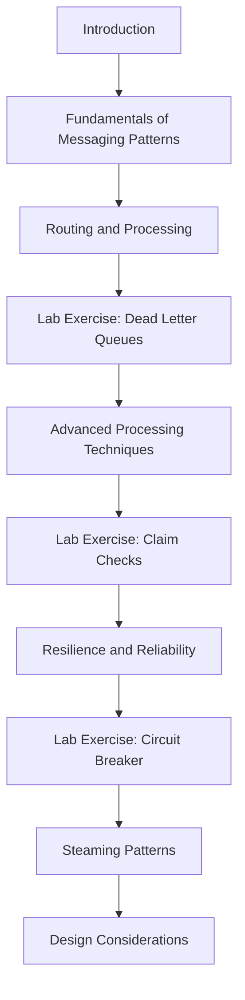

# Supercharge Your Architectures with Messaging Patterns

 🗣️Talk 🔵 Intermediate

**Abstract:**  
Join this full-day, hands-on workshop to revolutionize your cloud architectures with powerful messaging patterns. Discover how paradigms like Publish-Subscribe, Message Queues, and Request-Reply—leveraging Azure Service Bus—can be the critical building blocks for resilient, scalable, and responsive systems. Through interactive labs and real-world examples, you’ll gain practical skills and best practices to transform your architectural strategies.

**Repository:**  [GitHub Repository](https://github.com/TaleLearnCode/supercharge-your-architectures-with-messaging-patterns)

---

## Overview

Designing robust and agile systems is crucial in today's fast-evolving cloud landscape. This workshop immerses you in advanced messaging concepts, demonstrating how Azure Service Bus can be the backbone for event-driven, fault-tolerant architectures. You’ll explore practical applications—from setting up messaging services and deploying enterprise-grade patterns to troubleshooting common issues. The session is structured around comprehensive, hands-on labs and in-depth demos that showcase real-world scenarios, ensuring you can immediately apply these techniques in your projects.

#### Elevator Pitch

Master resilient cloud architectures in a full-day, interactive workshop that leverages Azure Service Bus to deploy messaging patterns for scalable, real-world solutions.

#### Tags

      

---

## Agenda / Outline

- **Introduction:** The session will begin with a warm welcome, an overview of the day's objectives, and a brief introduction to key concepts.
- **Fundamentals of Messaging Patterns:** Cover the basics, outlining why messaging is critical to modern architectures.
- **Routing and Processing:** Delve into how messages are efficiently routed and processed in distributed systems.
- **Lab Exercise: Dead Letter Queues:** Engage participants with a hands-on lab to manage message failures and errors.
- **Advanced Processing Techniques:** Explore sophisticated methods to process and transform messages at scale.
- **Lab Exercise: Claim Checks:** Provide practical experience using claim checks to manage large message payloads.
- **Resilience and Reliability:** Discuss strategies and patterns for building fault-tolerant, resilient messaging infrastructures.
- **Lab Exercise: Circuit Breaker:** Demonstrate an interactive session on implementing circuit breakers to ensure continuous service availability.
- **Steaming Patterns:** (Confirm if “Steaming” is the intended term or if it should be “Streaming” patterns.) Discuss patterns and best practices in handling real-time data flows.
- **Design Considerations:** Include key design takeaways and strategic insights to help participants apply these concepts in their environments.

---

## Key Takeaways

- **Practical Mastery:** Gain hands-on experience configuring and managing messaging services using Azure Service Bus.
- **Architectural Insight:** Learn to design and implement fault-tolerant, scalable messaging solutions.
- **Real-world Application:** Walk away with actionable insights and strategies to resolve communication bottlenecks in distributed systems.

---

## Materials & Resources

- **Source Code / Repository:** [Link to GitHub Repository](https://github.com/TaleLearnCode/supercharge-your-architectures-with-messaging-patterns)
- **Additional Links:** Supplementary blog posts, tools, or external resources mentioned during your talk.

---

## Event History

This table tracks every conference or event where this presentation has been submitted and the outcome.

| Event                      | Location                | Date       | Length | Submission   | Materials | Recording |
| -------------------------- | ----------------------- | ---------- | ------ | ------------ | --------- | --------- |
| Techorama Netherlands 2025 | Urecht, The Netherlands | 2025-04-18 | 480    | ⏳ 2025-04-18 | N/A       | N/A       |

✅ Accepted | ⏳ Pending | ❌ Rejected

---

## Audience & Engagement

This workshop is designed for software architects, developers, and IT professionals eager to modernize cloud systems. Whether exploring distributed services for the first time or enhancing an existing framework, you’ll benefit from practical labs, live demos, and interactive Q&A sessions. Expect an engaging environment where your participation drives deeper understanding, and take advantage of post-session resources and community connections for ongoing learning.

## Conference-Specific Customizations

Some conferences require adjustments to the presentation details to better align with their themes or audience. Below are the variations applied for specific event submissions.

### Techorama Netherlands 2025

**Title:** Game-Changing Messaging: A Playbook for Winning Cloud Architectures  
**Abstract:**  
Step onto the field and prepare to score big with your cloud architectures. In this full-day, hands-on workshop, you'll learn to execute winning plays using messaging patterns—akin to a championship playbook. With Azure Service Bus as your secret weapon, you'll master strategies like Publish-Subscribe, Message Queues, and Request-Reply to keep your systems agile, resilient, and always in the game. You'll gain the tactical know-how to optimize communications and outmaneuver any challenge on your digital playing field through energetic labs and real-world game scenarios.

**Tags:** JavaScript, AI, Innovation  

---

### Conference Name 2  

**Title:** "Tweaked Title for Event"  
**Abstract:**  
The abstract was modified to emphasize the security aspects of the presentation for this event. It introduces key concerns in modern web development and discusses solutions aligned with the conference’s theme.  

**Tags:** Security, Web Development  

---

## Final Thoughts

This workshop is more than a technical deep dive—it’s an invitation to radically rethink how you architect and design systems in the cloud. As the digital landscape evolves, so must your approach to building resilient and scalable infrastructures. Embrace these messaging patterns and join us in pioneering the next generation of cloud solutions. I look forward to exploring these transformative ideas and driving impactful change in our architecture.