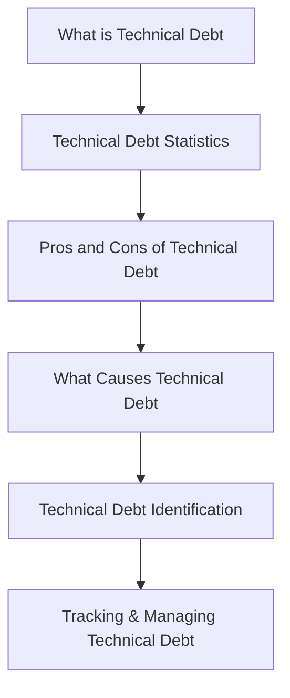

# Technical Debt Is Not Free

 🗣️Talk 🟢 Introductory

**Abstract:**  
So many software development teams inadvertently accumulate technical debt without realizing the long-term consequences. Even when teams recognize and document their technical debt, failing to take action can expose them to significant challenges. In this session, we explore the concept of technical debt and why reporting it is only the first step. More importantly, we’ll uncover actionable strategies for addressing and reducing technical debt, ensuring that short-term expedience does not snowball into long-term setbacks. You’ll learn how to properly track, manage, and repay technical debt to maintain a healthy, sustainable codebase through real-world examples and case studies.

**Repository:**  [GitHub Repository](https://github.com/yourusername/your-presentation-repo)

---

## Overview

Technical debt is much like financial debt in software development: if left unmanaged, it can lead to inevitable problems and expensive "interest payments" over time. This presentation takes a deep dive into the nuances of technical debt, explaining its origins, exploring practical methods for documentation, and, most crucially, outlining strategies to address and reduce it. With insights from real-world projects, the session is designed to help emerging and experienced engineering teams build sustainable practices that prevent technical debt from undermining long-term productivity and quality.

#### Elevator Pitch

Learn how to identify, document, and actively manage technical debt to safeguard your projects from long-term pitfalls, transforming potential liabilities into opportunities for continuous improvement.

#### Tags

     

---

## Agenda / Outline

- **What is Technical Debt?**: Define the concept of technical debt and establish why it matters.
- **Technical Debt Statistics:**   Present data and trends to illustrate the prevalence and impact of technical debt.
- **Pros and Cons of Technical Debt:**   Discuss the benefits and drawbacks, including scenarios where short-term debt may be acceptable.
- **What Causes Technical Debt:**   Explore the common factors, such as rushed deadlines, poor design, or evolving requirements, that lead to technical debt.
- **Technical Debt Identification:**   Learn the techniques and tools for identifying technical debt within your codebase.
- **Tracking & Managing Technical Debt**: Explore strategies for documenting, monitoring, and actively reducing technical debt to prevent long-term issues.

---

## Key Takeaways

- **Visibility is Vital:** Understand the importance of documenting and actively monitoring technical debt.
- **Actionable Strategies:** Discover practical methods to reduce technical debt and improve overall code quality.
- **Sustainable Development:** Learn how managing technical debt can pave the way for long-term project success and maintain architectural integrity.
- **Real-World Insights:** Gain insights from case studies demonstrating how proactive debt management transforms software delivery.

---

## Materials & Resources

- **Source Code / Repository:** [Link to GitHub Repository](https://github.com/yourusername/your-presentation-repo)
- **Additional Links:** Supplementary blog posts, tools, or external resources mentioned during your talk.

---

## Event History

This table tracks every conference or event where this presentation has been submitted and the outcome.

| Event                         | Location     | Date       | Length | Submission   | Materials | Recording |
| ----------------------------- | ------------ | ---------- | ------ | ------------ | --------- | --------- |
| DevOpsCon New York 2025       | New York, NY | 2025-09-28 | 45     | ⏳ 2025-04-18 | N/A       | N/A       |
| Prairie Dev Con Winnipeg 2025 | Manitoba, MB | 2025-09-22 | 60     | ⏳ 2025-05-08 | N/A       | N/A       |

✅ Accepted | ⏳ Pending | ❌ Rejected

---

## Audience & Engagement

This presentation is geared toward developers, software architects, technical leads, and engineering managers who are either beginning to see the effects of technical debt or are ready to take actionable steps to reduce it. The session includes interactive discussions, real-world case studies, and a live Q&A segment to facilitate practical knowledge sharing. Attendees can connect via social media and email for further dialogue and resource exchange.

## Conference-Specific Customizations

Some conferences require adjustments to the presentation details to better align with their themes or audience. Below are the variations applied for specific event submissions.

### Prairie Dev Con Winnipeg 2025

**Title:** Technical Debt Is Not Free  
**Abstract:**  
In our early rush to ship features, we unknowingly let quick fixes pile up until our codebase started screaming for attention. In this session, I'll share our candid journey of discovering that technical debt isn't free—it compounds, turning short-term expedience into long-term setbacks. Through real-world examples and case studies, I'll show how we learned to track, manage, and repay our debt before it crippled our projects. You’ll leave with actionable strategies and a clear blueprint to maintain a healthy, sustainable codebase, ensuring that each decision today sets you up for tomorrow’s success.

**Elevator Pitch:**  
Quick fixes quickly add up. Discover our journey of confronting hidden technical debt before it crippled our codebase—and learn actionable strategies to track, manage, and repay it for a sustainable future.

---

### Conference Name 2  

**Title:** "Tweaked Title for Event"  
**Abstract:**  
The abstract was modified to emphasize the security aspects of the presentation for this event. It introduces key concerns in modern web development and discusses solutions aligned with the conference’s theme.  

**Tags:** Security, Web Development  

---

## Final Thoughts

Technical debt is an inevitable byproduct of software development; however, with the right tools, practices, and mindset, it can be managed—if not entirely eliminated. This session empowers you with the insights needed to document your technical debt and take decisive steps toward mitigating its risks. As your projects and teams evolve, the strategies outlined here will serve as a cornerstone for maintaining a healthy and resilient codebase.