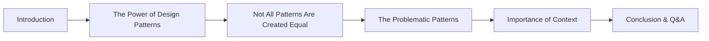

# Your Talk Title

 🗣️Talk 🟢 Introductory

**Abstract:**  
A concise introduction that captures the essence of your presentation, highlighting the core message and what your audience can expect to learn.

**Repository:**  [GitHub Repository](https://github.com/yourusername/your-presentation-repo)

---

## Overview

Provide an expanded description of your talk. Explain how the content has evolved and why it remains relevant across different contexts. Offer insight into the main narrative and the underlying themes.

#### Elevator Pitch

Not all design patterns are created equal—some introduce unintended complexity. Learn how to spot pitfalls, navigate trade-offs, and apply patterns wisely to build better software.

#### Tags

      

---

## Agenda / Outline

- **Introduction:**  
  Kick off with an engaging overview of the topic and a brief personal introduction.
- **Problem Statement:**  
  Explain the challenges or opportunities your talk addresses.
- **Main Content:**  
  Detail the core material, including methodologies, perspectives, live demonstrations, or code walkthroughs.
- **Case Studies / Demos:**  
  Incorporate real-world examples or demos to bring the concepts to life.
- **Conclusion & Q&A:**  
  Summarize the key points and open the floor for questions or further discussion.

---

## Key Takeaways

-  **Insight 1:** A standout learning or perspective.
-  **Insight 2:** Additional critical knowledge for your audience.
- **Insight 3:** More actionable tips or insights to build upon.

---

## Materials & Resources

- **Source Code / Repository:** [Link to GitHub Repository](https://github.com/yourusername/your-presentation-repo)
- **Additional Links:** Supplementary blog posts, tools, or external resources mentioned during your talk.

---

## Event History

This table tracks every conference or event where this presentation has been submitted and the outcome.

| Event   | Location      | Date       | Length | Submission   | Materials                                 | Recording                                |
| ------- | ------------- | ---------- | ------ | ------------ | ----------------------------------------- | ---------------------------------------- |
| Event 1 | City, Country | YYYY-MM-DD | xxx    | ✅ YYYY-MM-DD | [View Slides](https://link-to-slides.com) | [Watch Video](https://link-to-video.com) |
| Event 2 | City, Country | YYYY-MM-DD | xxx    | ⏳ YYYY-MM-DD | N/A                                       | N/A                                      |
| Event 3 | City, Country | YYYY-MM-DD | xxx    | ❌ YYYY-MM-DD | N/A                                       | N/A                                      |

✅ Accepted | ⏳ Pending | ❌ Rejected

---

## Audience & Engagement

Describe the intended audience, any prerequisites, and the types of interactive segments in your session (e.g., live demos, Q&A segments). Also, list your preferred methods for attendees to provide feedback or connect with you (social media, email, etc.).

## Conference-Specific Customizations

Some conferences require adjustments to the presentation details to better align with their themes or audience. Below are the variations applied for specific event submissions.

### Conference Name 1  
**Title:** "Custom Talk Title for This Event"  
**Abstract:**  
This version of the abstract was tailored to the conference theme. It highlights specific challenges and industry trends that align with the event’s focus. The adaptation ensures relevance while maintaining the core message of the talk.  

**Tags:** JavaScript, AI, Innovation  

---

### Conference Name 2  
**Title:** "Tweaked Title for Event"  
**Abstract:**  
The abstract was modified to emphasize the security aspects of the presentation for this event. It introduces key concerns in modern web development and discusses solutions aligned with the conference’s theme.  

**Tags:** Security, Web Development  

---

## Final Thoughts

Conclude with your reflections, acknowledgments, or notes on how the presentation has evolved. Mention any upcoming revisions or areas where the content might adapt to future trends and technologies.