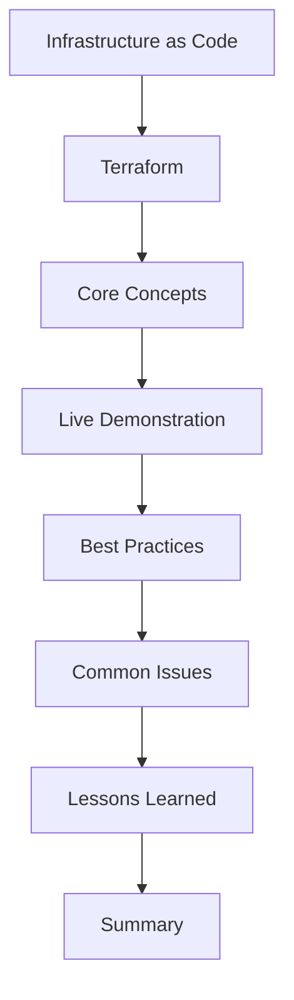

# Terraform: The Developer's Swiss Army Knife for Infrastructure

 🗣️Talk 🔵 Intermediate

**Abstract:**  
Exploring the landscape of infrastructure automation, this presentation illuminates Terraform as an indispensable tool for developers navigating the complexities of modern technology ecosystems. Attendees will journey through the fundamentals of Infrastructure as Code (IaC), experiencing how Terraform's declarative configuration language transforms development workflows. Through hands-on demonstrations, you'll discover how Terraform seamlessly integrates with cloud services and APIs to enable the creation of scalable and maintainable infrastructure deployments. Emphasizing collaboration, the session highlights Terraform's role in bridging the gap between development and operations teams, fostering a shared responsibility and innovation culture. Equip yourself with the knowledge to wield Terraform as your ultimate Swiss Army knife for modern infrastructure automation.

**Repository:**  [GitHub Repository](https://github.com/TaleLearnCode/TerraformSwissArmyKnife)

---

## Overview

Infrastructure automation is more critical than ever in today’s rapidly evolving tech landscape. This talk provides an in-depth look at Terraform—one of the most powerful tools in the Infrastructure as Code toolkit. We will explore the fundamentals of Terraform’s declarative language and demonstrate its real-world applications in managing cloud services and APIs. Through practical examples and interactive demos, you'll learn how Terraform can streamline your development workflows, promote collaboration between development and operations teams, and simplify the complexity of modern infrastructure management.

#### Elevator Pitch

Unlock Terraform's power to automate and scale your infrastructure easily. Learn its core concepts and hands-on techniques, and discover how it bridges the gap between development and operations for seamless deployment.

#### Tags

   

---

## Agenda / Outline

- **Infrastructure as Code (IaC):**   Introduce the fundamentals of IaC and its significance in modern infrastructure management.
- **Terraform:**   Provide an overview of Terraform, its role within IaC, and why developers rely on it.
- **Core Concepts:**   Delve into the key concepts of Terraform’s language and architecture.
- **Live Demonstration:**   Showcase a practical demo illustrating Terraform workflows in real-world scenarios.
- **Best Practices:**   Share proven strategies for writing, maintaining, and scaling Terraform configurations.
- **Common Issues:**   Identify frequent challenges faced during Terraform adoption and deployment.
- **Lessons Learned:**   Discuss insights, tips, and real-world stories highlighting effective usage and pitfalls.
- **Summary:**   Recap the session’s key takeaways and provide actionable next steps for attendees.

---

## Key Takeaways

- **IaC Mastery:** Understand the core principles behind Infrastructure as Code and Terraform.

  **Practical Skills:** Gain hands-on experience with live demonstrations that empower your automation workflows.

  **Best Practices & Pitfalls:** Learn to identify common issues and apply best practices to avoid them.

  **Collaborative Deployment:** Discover how Terraform fosters a seamless integration between development and operations teams.

---

## Materials & Resources

- **Source Code / Repository:** [Link to GitHub Repository](https://github.com/TaleLearnCode/TerraformSwissArmyKnife)
- **Additional Links:** Supplementary blog posts, tools, or external resources mentioned during your talk.

---

## Event History

This table tracks every conference or event where this presentation has been submitted and the outcome.

| Event                   | Location     | Date       | Length | Submission   | Materials | Recording |
| ----------------------- | ------------ | ---------- | ------ | ------------ | --------- | --------- |
| DevOpsCon New York 2025 | New York, NY | 2025-09-28 | 45     | ⏳ 2025-04-18 | N/A       | N/A       |

✅ Accepted | ⏳ Pending | ❌ Rejected

---

## Audience & Engagement

This session is intended for developers, DevOps engineers, and cloud architects keen on modernizing their infrastructure automation practices. Expect interactive demonstrations, real-world examples, and collaborative Q&A segments to empower you with practical Terraform skills. Attendees can connect via social media and email for additional discussions and resource sharing.

## Conference-Specific Customizations

Some conferences require adjustments to the presentation details to better align with their themes or audience. Below are the variations applied for specific event submissions.

### Conference Name 1  

**Title:** "Custom Talk Title for This Event"  
**Abstract:**  
This version of the abstract was tailored to the conference theme. It highlights specific challenges and industry trends that align with the event’s focus. The adaptation ensures relevance while maintaining the core message of the talk.  

**Tags:** JavaScript, AI, Innovation  

---

### Conference Name 2  

**Title:** "Tweaked Title for Event"  
**Abstract:**  
The abstract was modified to emphasize the security aspects of the presentation for this event. It introduces key concerns in modern web development and discusses solutions aligned with the conference’s theme.  

**Tags:** Security, Web Development  

---

## Final Thoughts

Terraform provides the flexibility and power to transform complex infrastructure challenges into streamlined, automated workflows. This session demystifies Terraform’s core concepts and imparts actionable insights to optimize your IaC practices. As the world of cloud infrastructure continues to evolve, embracing Terraform will be key to staying agile and innovative.