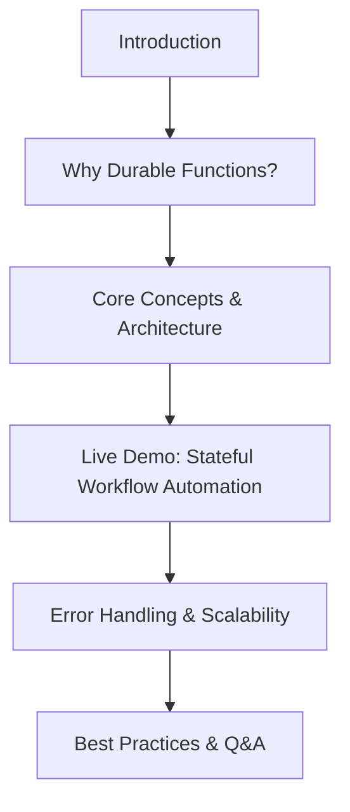

# Transform Chaos into Order with Azure Durable Functions

 🗣️Talk 🔵 Intermediate

**Abstract:**  
Azure Durable Functions empowers enterprise developers to manage **stateful, long-running workflows** in serverless .NET applications. This session will guide you through **step-by-step demos** and best practices to streamline intricate business processes, whether tackling **complex order processing** or ensuring **regulatory compliance**. Learn how to build **resilient orchestrations** that simplify state management, scale effortlessly, and boost operational efficiency. Whether modernizing legacy systems or architecting agile cloud solutions, gain actionable insights to transform complicated workflows into robust, high-performing applications.

**Repository:**  [GitHub Repository](https://github.com/yourusername/your-presentation-repo)

---

## Overview

Enterprise workflows can be complicated, but don’t have to be chaotic. **Azure Durable Functions** provides a structured approach to managing stateful processes in a serverless environment. In this talk, you’ll learn how to simplify complex business operations using **orchestrator functions**, reliable execution patterns, and real-world solutions that improve efficiency.

#### Elevator Pitch

Durable Functions turns complicated, multi-step business logic into seamless workflows that scale effortlessly. Learn best practices, avoid common pitfalls, and architect robust cloud solutions that keep your operations smooth and reliable.

#### Tags

      

---

## Agenda / Outline

- **Introduction:** Overview of Durable Functions and why stateful workflows matter
- **Core Concepts:** Exploring orchestrators, activities, and patterns for scalable automation
- **Live Demo:** Step-by-step implementation of Durable Functions in a business workflow
- **Error Handling & Scalability:** Ensuring fault tolerance and building **resilient** cloud applications
- **Best Practices & Q&A:** Actionable takeaways and discussion

---

## Key Takeaways

- **Master Enterprise Workflow Orchestration:** Implement long-running, stateful processes with confidence
- **Turn Complexity into Streamlined Action:** Learn through real-world demos and best practices.
- **Build Resilient, Future-Proof Cloud Solutions:** Architect scalable, fault-tolerant serverless applications

---

## Materials & Resources

- **Source Code / Repository:** [Link to GitHub Repository](https://github.com/yourusername/your-presentation-repo)
- **Additional Links:** Supplementary blog posts, tools, or external resources mentioned during your talk.

---

## Event History

This table tracks every conference or event where this presentation has been submitted and the outcome.

| Event                         | Location     | Date       | Length | Submission   | Materials | Recording |
| ----------------------------- | ------------ | ---------- | ------ | ------------ | --------- | --------- |
| Prairie Dev Con Winnipeg 2025 | Winnipeg, MB | 2025-09-22 | 60     | ⏳ 2025-05-08 | N/A       | N/A       |

✅ Accepted | ⏳ Pending | ❌ Rejected

---

## Audience & Engagement

This session is designed for **enterprise developers, cloud architects, and engineering teams** looking to simplify stateful workflows in serverless applications. No prior experience with Azure Durable Functions is required, but a basic understanding of **.NET and cloud-based development** will be helpful.

Attendees will engage with:

- **Live demos** showcasing step-by-step implementations of real-world use cases
- **Interactive discussions** on best practices, scalability, and troubleshooting common challenges
- **Q&A sessions** to address specific questions and explore advanced patterns

For post-session engagement, participants can connect via GitHub discussions, LinkedIn, or community forums to share insights and continue learning together.

## Conference-Specific Customizations

Some conferences require adjustments to the presentation details to better align with their themes or audience. Below are the variations applied for specific event submissions.

### Prairie Dev Con Winnipeg 2025

**Title:** From Chaos to Order: Our Journey with Azure Durable Functions  
**Abstract:**  
Our team once wrestled with convoluted business processes that threatened to derail productivity—until we discovered Azure Durable Functions. In this session, I recount our hands-on journey from grappling with stateful, long-running workflows to orchestrating elegant, resilient solutions. I’ll share the critical turning points: how we transformed complex order processing challenges and navigated strict regulatory requirements by building scalable, serverless .NET applications. Through step-by-step demos and live examples, you’ll see how our approach to durable function orchestrations simplifies state management and boosts efficiency and reliability. Join me to uncover the actionable strategies that turned our chaos into a finely tuned system, and learn how these methods can revolutionize your cloud architecture.

**Elevator Pitch:**  
Transform chaos into order! Join our journey with Azure Durable Functions as we turn tangled workflows into resilient, scalable orchestrations through live demos and real-world tactics—unlocking the secret to efficient, serverless systems.

---

## Final Thoughts

Durable Functions unlock a new approach to workflow automation, ensuring that complex business processes remain reliable, scalable, and efficient. Developers can transform legacy systems and modern architectures by leveraging orchestrators, state management, and fault tolerance.

This talk is built to provide practical strategies that can be immediately applied to real-world projects, helping teams reduce complexity, streamline operations, and future-proof their applications.

Looking forward to sharing these insights and helping the community harness the full potential of Azure Durable Functions!